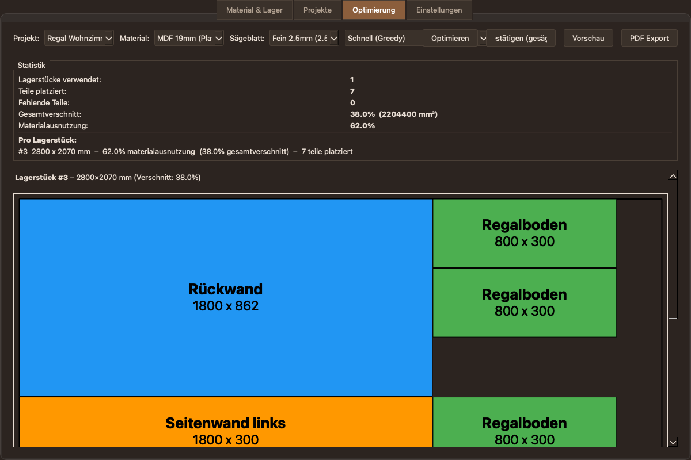
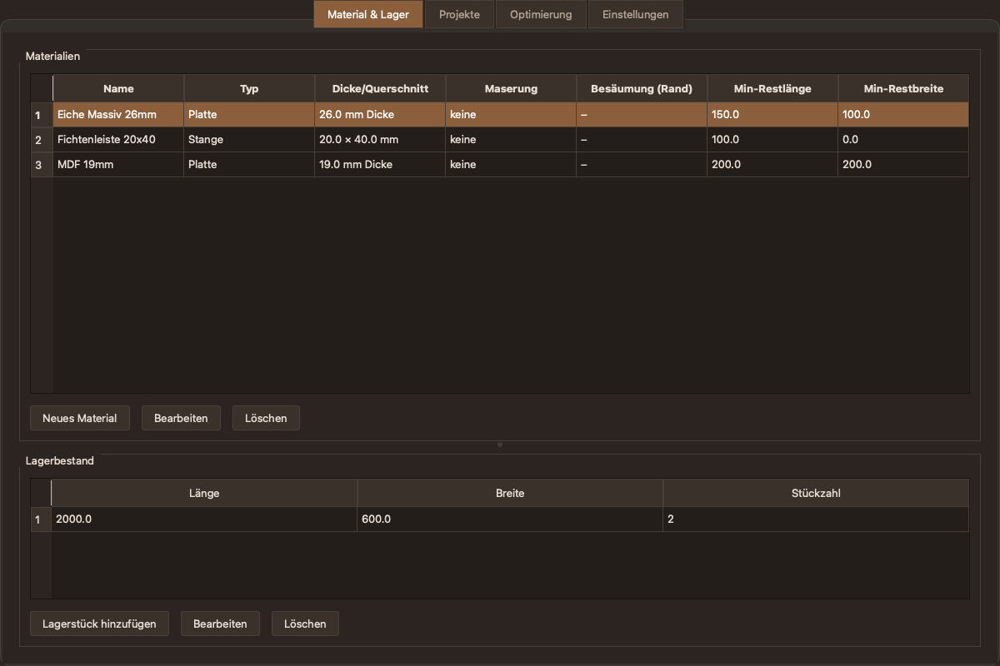
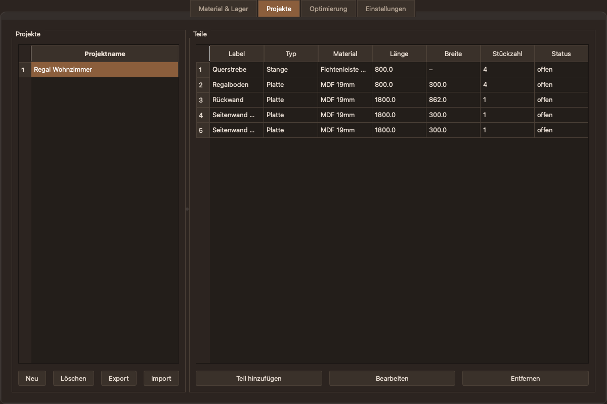
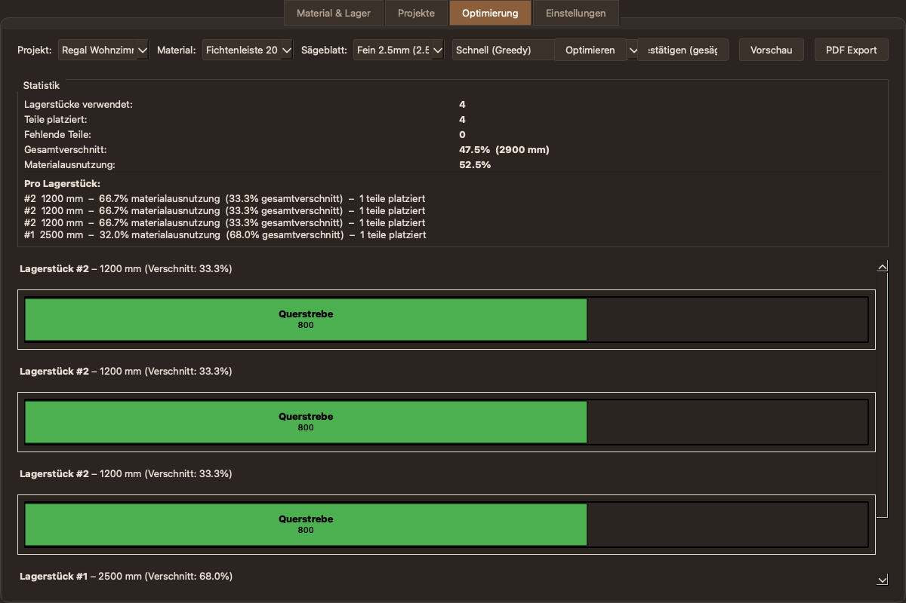
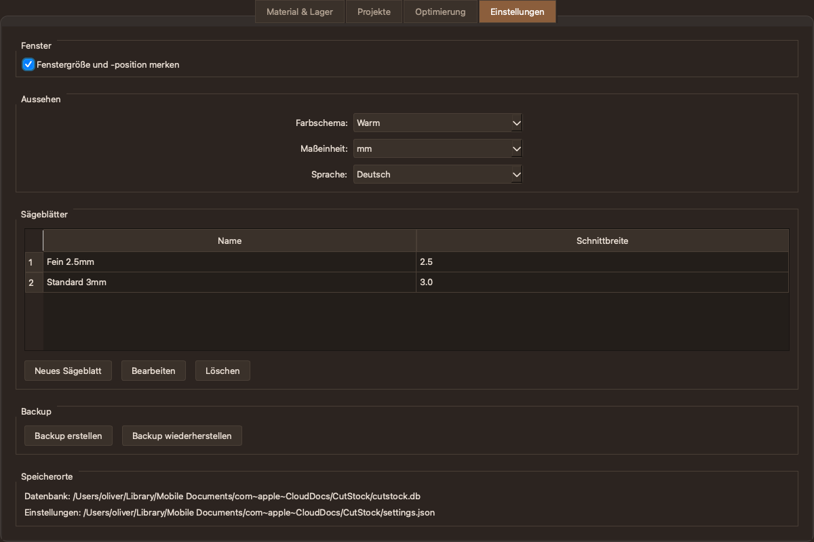

# CutStock

**Verschnitt minimieren. Jedes Brett, jede Stange, jede Platte optimal nutzen.**

CutStock ist eine Desktop-Anwendung zur Verschnittoptimierung, die Holzwerkern, Makern und kleinen Werkstaetten hilft, das Maximum aus ihrem Material herauszuholen. Ob Plattenteile fuer ein Regal oder Stangenprofile fuer einen Rahmen -- CutStock berechnet den optimalen Schnittplan, verwaltet den Lagerbestand und exportiert druckfertige Schnittplaene als PDF.



> **[English version](README.md)**

## Funktionen

- **1D + 2D Optimierung** -- Stangen (1D Bin-Packing) und Platten (2D Guillotine-Packing) mit Saegeblatt-Schnittbreite (Kerf)
- **Drei Algorithmen** -- Schnell (Greedy), Nested Guillotine (intelligente Schnittrichtung), Gruendlich (Genetischer Algorithmus, ~95% Ausnutzung)
- **Maserungsrichtung** -- beruecksichtigt Holzmaserung pro Material und Teil (laengs, quer oder egal)
- **Besaeumung** -- konfigurierbarer Rand fuer beschaedigte Plattenkanten
- **Lagerverwaltung** -- Bestand verfolgen, verbrauchte Stuecke automatisch austragen, verwertbare Reste automatisch einbuchen
- **Projektverwaltung** -- Teile nach Projekten organisieren, Import/Export als JSON
- **Visuelle Schnittplaene** -- farbkodierte Zuschnittschemata mit Labels und Massen
- **PDF-Export** -- kompaktes mehrseitiges Layout (2-spaltig fuer Stangen, proportional fuer Platten)
- **Druckvorschau** -- oeffnet PDF im System-Viewer vor dem Speichern
- **Statistik** -- detaillierte Verschnittanalyse pro Lagerstueck und Gesamtwerte
- **Backup/Restore** -- komplette Datenbank + Einstellungen als ZIP
- **Mehrsprachig** -- Deutsch, English, Francais, Italiano
- **5 Farbschemata** -- Standard, Dunkel, Hell, Blaugrau, Warm
- **Plattformuebergreifend** -- macOS (.app), Windows (.exe), Linux
- **iCloud-Sync** -- Datenbank und Einstellungen synchronisieren automatisch zwischen Macs

## Screenshots

### Material & Lager

Materialien (Platten, Stangen) mit Dicke, Querschnitt, Maserungsrichtung, Besaeumung und Rest-Schwellen verwalten. Der Lagerbestand zeigt die Stuecke des gewaehlten Materials.



### Projekte

Teile nach Projekten organisieren. Jedes Teil hat ein Label, Typ, Material, Masse, Stueckzahl und Maserungsrichtung. Projekte als JSON importieren/exportieren.



### Optimierung -- Stangen

Projekt, Material, Saegeblatt und Algorithmus waehlen. Der Optimierer berechnet den besten Schnittplan und zeigt farbkodierte Zuschnittschemata mit Statistik.



### Optimierung -- Platten

2D Guillotine-Packing fuer Plattenwerkstoffe. Alle Schnitte gehen von Kante zu Kante, so dass alle Reste Rechtecke bleiben und wiederverwendbar sind.


### Einstellungen

Sprache, Farbschema, Masseinheit (mm/cm), Saegeblaetter, Backup/Restore konfigurieren.



## Algorithmen

CutStock loest das klassische [Cutting-Stock-Problem](https://de.wikipedia.org/wiki/Cutting-Stock-Problem) mit drei Ansaetzen:

### Warum Guillotine-Schnitte?

Alle CutStock-Algorithmen verwenden **Guillotine-Schnitte** -- jeder Schnitt geht komplett von Kante zu Kante. Das ist eine bewusste Entscheidung:

| Verfahren | Materialausnutzung | Reste | Benoetigtes Werkzeug |
|-----------|-------------------|-------|---------------------|
| **Guillotine** (CutStock) | ~85-95% | Immer rechteckig | Tischkreissaege, Handkreissaege |
| **Free-Cut** | ~93-98% | L-foermig, T-foermig | CNC-Fraese noetig |

Guillotine-Schnitte kann man mit jeder handelsüblichen Saege ausfuehren. Die Reste sind immer saubere Rechtecke die gelagert und wiederverwendet werden koennen. Die 5-10% bessere Ausnutzung von Free-Cut-Algorithmen erfordert eine CNC-Fraese und erzeugt unregelmaessige Reste -- fuer die meisten Werkstaetten nicht praktikabel.

### 1D -- Stangen / Profile

- **Schnell (Greedy FFD):** First-Fit-Decreasing -- sortiert Teile nach Laenge, platziert jedes auf der ersten passenden Stange. Sofortiges Ergebnis.
- **Gruendlich (GA):** Genetischer Algorithmus -- entwickelt 80 Permutationen ueber 200 Generationen fuer bessere Kombinationen.

### 2D -- Platten / Bretter

- **Schnell (Greedy):** Best-Area-Fit Guillotine-Packing. Spaltet immer erst horizontal (rechts + unten).
- **Nested Guillotine:** Wie Greedy, testet aber **beide Split-Richtungen** (horizontal und vertikal) an jeder Schnittstelle und waehlt die, die den groessten nutzbaren Rest erzeugt. Bessere Ergebnisse bei asymmetrischen Teilen.
- **Gruendlich (GA):** Genetischer Algorithmus -- optimiert Platzierungsreihenfolge und Drehungsentscheidungen ueber 200 Generationen. Beste Ergebnisse, dauert aber 2-5 Sekunden.

### Alle Algorithmen beruecksichtigen:

- **Schnittbreite (Kerf)** -- wird bei jedem Schnitt abgezogen
- **Besaeumung** -- beschaedigte Kanten werden vor dem Zuschnitt entfernt
- **Maserungsrichtung** -- Teile werden nur in Orientierungen platziert die zur Holzmaserung passen
- **Endlicher Vorrat** -- verwendet kleinste/Rest-Stuecke zuerst, meldet Teile die nicht passen

## Download

Fertige Builds fuer macOS und Windows gibt es auf der [Releases-Seite](https://github.com/orohde/CutStock/releases).

> **Wichtig: Unsignierte Builds**
>
> Die Releases sind **nicht code-signiert** (kein kostenpflichtiges Apple/Microsoft-Entwicklerzertifikat).
> Das Betriebssystem zeigt beim ersten Start eine Sicherheitswarnung:
>
> - **macOS**: Rechtsklick auf die App, "Oeffnen" waehlen, dann nochmal "Oeffnen" klicken (umgeht Gatekeeper)
> - **Windows**: Auf "Weitere Informationen" klicken, dann "Trotzdem ausfuehren" (umgeht SmartScreen)
>
> Das ist normal fuer Open-Source-Software. Der Quellcode ist vollstaendig einsehbar.

## Installation (aus Quellcode)

### Voraussetzungen

- Python 3.12+
- macOS, Windows oder Linux

### Einrichtung

```bash
git clone <repository-url>
cd CutStock
./setup.sh        # Erstellt venv, installiert Abhaengigkeiten
```

### Starten (Entwicklung)

```bash
./run.sh
```

### Standalone-App bauen

**macOS:**
```bash
./build.sh         # Erstellt dist/CutStock.app
```

**Windows:**
```bat
build_windows.bat   # Erstellt dist\CutStock\CutStock.exe
```

## Datenspeicherung

| Datei | macOS | Windows |
|-------|-------|---------|
| Datenbank | `iCloud Drive/CutStock/cutstock.db` | `%APPDATA%\CutStock\cutstock.db` |
| Einstellungen | `iCloud Drive/CutStock/settings.json` | `%APPDATA%\CutStock\settings.json` |

Auf macOS synchronisieren Datenbank und Einstellungen automatisch ueber iCloud Drive zwischen Macs. Ein Heartbeat-basierter Lock-Mechanismus verhindert gleichzeitigen Zugriff.

## Technologie

- **Python 3.12+** -- Anwendungslogik
- **PySide6 (Qt 6)** -- plattformuebergreifende GUI
- **SQLite** -- lokale Datenbank (kein Server noetig)
- **reportlab** -- PDF-Erzeugung
- **PyInstaller** -- Standalone-App-Paketierung

## Projektstruktur

```
CutStock/
  core/
    db.py          -- SQLite-Schema + Repository-Pattern
    models.py      -- Datenklassen (Material, Lagerstueck, Projekt, Teil, ...)
    optimize.py    -- 1D/2D Optimierungsalgorithmen (Greedy + GA)
    pdf.py         -- PDF-Export mit Schnittplan-Zeichnungen
    lock.py        -- iCloud-sicheres Datei-Locking
    settings.py    -- JSON-basierte Einstellungen
  ui/
    main_window.py -- Hauptfenster mit Tabs
    tab_material_lager.py -- Material- und Lagerverwaltung
    tab_projekt.py -- Projekt- und Teileverwaltung
    tab_optimierung.py -- Optimierung und Visualisierung
    tab_einstellungen.py -- Einstellungen, Saegeblaetter, Backup
    i18n.py        -- Uebersetzungen (DE/EN/FR/IT)
    units.py       -- mm/cm Einheitenumrechnung
  tests/
    test_optimize.py -- Algorithmen-Tests
  assets/
    icon.jpg/icns/ico -- App-Icon
  run.py           -- Einstiegspunkt
```

## Lizenz

**CC BY-NC-SA 4.0** -- frei fuer private Nutzung, keine kommerzielle Nutzung, Namensnennung erforderlich.

Siehe [LICENSE](LICENSE) fuer Details.

## Mitmachen

Beitraege sind willkommen! Bitte zunaechst ein Issue oeffnen um die geplante Aenderung zu besprechen.

Zum Hinzufuegen einer neuen Sprache: siehe `ui/i18n.py` -- einfach den Sprachcode bei `LANGUAGES` ergaenzen und fuer jeden Key in `TRANSLATIONS` eine Uebersetzung hinzufuegen.
