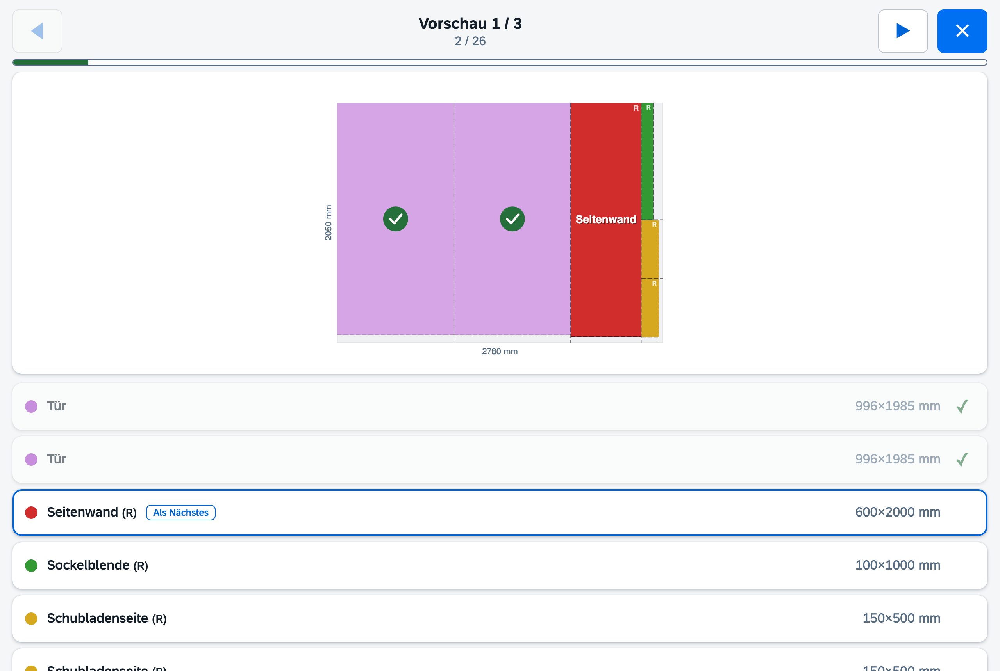

# CutStock

**Minimize waste. Maximize every board, bar, and panel.**

CutStock is a cut optimization tool (Verschnittoptimierung) that helps woodworkers, makers, and small workshops get the most out of their material. Whether you're cutting panels for a bookshelf or bars for a frame -- CutStock calculates the optimal cutting layout, tracks your stock, and exports print-ready cut plans as PDF.

CutStock comes in two flavors that share the same optimization core:

- **Desktop app** (macOS, Windows, Linux) -- double-click, works offline, data stays local (native window around the web UI via pywebview)
- **Web app** (Docker) -- self-hosted, reachable from any browser or tablet in your network


> **[Deutsche Version](README.de.md)**

## Features

- **1D + 2D Optimization** -- bars (1D bin-packing) and panels (2D guillotine packing) with saw blade kerf
- **Three Algorithms** -- Fast (Greedy), Nested Guillotine (smart split direction), Thorough (Genetic Algorithm, ~95% utilization)
- **Grain Direction** -- respects wood grain per material and part (lengthwise, crosswise, or any)
- **Edge Trimming** -- configurable trim margin for damaged board edges
- **Stock Management** -- track inventory, auto-deduct used pieces, auto-add usable remnants
- **Project Management** -- organize parts by project, import/export as JSON, import part lists from CSV
- **Visual Cut Plans** -- color-coded cutting diagrams with labels and dimensions
- **Cutting Sequence** -- numbered, kerf-accurate step-by-step sawing order per cut plan (on screen and in the PDF)
- **Workshop Mode** -- full-screen touch view for a tablet at the saw: big targets, progress bar, tap pieces as you cut
- **Labels** -- printable labels for sawn parts and remnants (A4 sheets like Avery 3475/L7160 or Dymo/Brother label printers, custom sizes)
- **PDF Export** -- compact multi-page layout (2-column for bars, proportional for panels)
- **Statistics** -- detailed waste analysis per stock piece and totals
- **Backup/Restore** -- full database + settings as ZIP (desktop)
- **Multi-language** -- English, Deutsch, Francais, Italiano
- **SAP Horizon Design** -- identical Fiori look in desktop and web, light and dark theme
- **Keyboard Shortcuts** -- fully keyboard-driven workflow, remappable in the web app
- **Cross-platform** -- macOS (.app), Windows (.exe), Linux, Docker
- **iCloud Sync** -- desktop database and settings sync between Macs automatically

## Web App (Docker)

The web app serves the same optimization engine through a FastAPI backend with a
SAP Fiori (Horizon) interface. All assets are bundled -- no internet connection
required at runtime.

### Quick start with Docker Compose

```yaml
services:
  cutstock:
    image: ghcr.io/orohde/cutstock:latest
    container_name: cutstock
    restart: unless-stopped
    ports:
      - "8420:8000"
    volumes:
      - ./data:/data
    environment:
      - CUTSTOCK_DB=/data/cutstock.db
```

```bash
docker compose up -d
```

Then open `http://localhost:8420` in your browser.

### Quick start with docker run

```bash
docker run -d --name cutstock \
  -p 8420:8000 \
  -v "$(pwd)/data:/data" \
  ghcr.io/orohde/cutstock:latest
```

### Build the image yourself

```bash
git clone https://github.com/orohde/CutStock.git
cd CutStock
docker build -t cutstock .
docker run -d -p 8420:8000 -v "$(pwd)/data:/data" cutstock
```

### Notes

| Topic | Detail |
|-------|--------|
| Port | Container listens on `8000`; map any host port you like (`8420` in the examples) |
| Data | SQLite database + `settings.json` live in the `/data` volume |
| Unraid | Use `/mnt/user/appdata/cutstock:/data` as the volume mapping |
| Reverse proxy | Plain HTTP backend, works behind nginx, Traefik, Zoraxy, Caddy, ... |
| Users | Single-user by design -- no authentication built in; use your reverse proxy/SSO if exposed |

The web UI covers materials, stock, projects, parts, optimization with visual
cut plans, PDF export, and settings. Keyboard shortcuts are listed on the
Settings page and can be remapped there (click a key, press the new one).

## Screenshots

### Material & Stock

Manage materials (panels, bars) with thickness, cross-section, grain direction, edge trim, and minimum remnant thresholds. Stock pieces are shown for the selected material.


### Projects

Organize parts by project. Each part has a label, type, material, dimensions, quantity, and grain direction. Import/export projects as JSON.


### Optimization -- Bars

Select a project, material, saw blade, and algorithm. The optimizer calculates the best cutting layout and displays color-coded cut plans with statistics.


### Optimization -- Panels

2D guillotine packing for panels. All cuts go edge-to-edge, keeping every remnant rectangular and reusable. The numbered cutting sequence below each plan tells you exactly where to cut, with the saw kerf already accounted for.


### Workshop Mode

Full-screen view for a tablet next to the saw: one panel per page, large touch targets, overall progress, and an "up next" marker. Marking a piece updates part progress and stock live.



### Settings

Configure language, color theme (Horizon light/dark), unit (mm/cm), label paper format (A4 sheets or label printers), saw blades, keyboard shortcuts, and backup/restore.


## Algorithms

CutStock solves the classic [Cutting Stock Problem](https://en.wikipedia.org/wiki/Cutting_stock_problem) using three approaches:

### Why Guillotine Cuts?

All CutStock algorithms use **guillotine cuts** -- every cut goes completely from edge to edge. This is a deliberate choice:

| Approach | Material Utilization | Remnants | Required Tools |
|----------|---------------------|----------|----------------|
| **Guillotine** (CutStock) | ~85-95% | Always rectangular | Table saw, circular saw |
| **Free-Cut** | ~93-98% | L-shaped, T-shaped | CNC router required |

Guillotine cuts can be made with any standard saw. The remnants are always clean rectangles that can be stored and reused. The 5-10% better utilization of free-cut algorithms requires a CNC router and produces irregular remnants that are difficult to reuse -- not practical for most workshops.

### 1D -- Bars / Profiles

- **Fast (Greedy FFD):** First-Fit-Decreasing -- sorts parts by length, places each on the first bar that fits. Instant results.
- **Thorough (GA):** Genetic Algorithm -- evolves 80 permutations over 200 generations to find better combinations.

### 2D -- Panels / Boards

- **Fast (Greedy):** Best-Area-Fit guillotine packing. Always splits horizontally first (right + below).
- **Nested Guillotine:** Same as Greedy but tests **both split directions** (horizontal and vertical) at each cut and picks the one that creates the largest usable remnant. Better results on complex layouts with asymmetric parts.
- **Thorough (GA):** Genetic Algorithm -- optimizes both placement order and rotation decisions across 200 generations. Best results but takes 2-5 seconds.

### All algorithms respect:

- **Saw blade kerf** -- subtracted at every cut
- **Edge trimming** -- damaged edges removed before cutting
- **Grain direction** -- parts placed only in orientations that match the wood grain
- **Finite stock** -- uses smallest/remnant pieces first, reports parts that don't fit

## Download (Desktop)

Pre-built binaries for macOS and Windows are available on the [Releases page](https://github.com/orohde/CutStock/releases).

> **Important: Unsigned builds**
>
> The releases are **not code-signed** (no paid Apple/Microsoft developer certificate).
> Your operating system will show a security warning on first launch:
>
> - **macOS**: Right-click the app, select "Open", then click "Open" again to bypass Gatekeeper
> - **Windows**: Click "More info", then "Run anyway" to bypass SmartScreen
>
> This is normal for open-source software. The source code is fully available for review.

## Installation (from source)

### Desktop

Prerequisites: Python 3.12+, macOS/Windows/Linux

```bash
git clone https://github.com/orohde/CutStock.git
cd CutStock
./setup.sh        # Creates venv, installs dependencies
./run.sh          # Run (development)
```

Build a standalone app:

```bash
./build.sh          # macOS: creates dist/CutStock.app
build_windows.bat   # Windows: creates dist\CutStock\CutStock.exe
```

### Web (without Docker)

```bash
git clone https://github.com/orohde/CutStock.git
cd CutStock
python3 -m venv .venv && source .venv/bin/activate
pip install -r requirements-web.txt
CUTSTOCK_DB=./data/cutstock.db uvicorn web.app:app --host 0.0.0.0 --port 8000
```

## Data Storage

| Variant | Database | Settings |
|---------|----------|----------|
| macOS | `iCloud Drive/CutStock/cutstock.db` | `iCloud Drive/CutStock/settings.json` |
| Windows | `%APPDATA%\CutStock\cutstock.db` | `%APPDATA%\CutStock\settings.json` |
| Docker | `/data/cutstock.db` (volume) | `/data/settings.json` (volume) |

On macOS, the desktop database and settings sync automatically via iCloud Drive between Macs. A heartbeat-based lock mechanism prevents concurrent access.

The desktop app and the web app share the exact same interface: the desktop
build runs the same FastAPI backend locally and shows it in a native window
via [pywebview](https://pywebview.flowrl.com/) (WKWebView on macOS, WebView2 on
Windows, WebKitGTK on Linux). One UI codebase, two ways to run it.

> **Desktop prerequisites**
> - **macOS**: nothing extra -- WKWebView is built in.
> - **Windows**: needs the WebView2 runtime (preinstalled on Windows 11; on
>   Windows 10 usually present via Edge, otherwise install Microsoft's free
>   Evergreen runtime).
> - **Linux**: needs WebKitGTK (`webkit2gtk`, package name varies by distro).
>   On servers/NAS the Docker web app is usually the better choice.

## Tech Stack

- **Python 3.12+** -- application logic
- **FastAPI + Uvicorn** -- backend (desktop runs it locally, Docker serves it)
- **pywebview** -- native desktop window around the web UI
- **SAP Fundamental Styles / Horizon theme** -- UI design system (bundled, Apache-2.0)
- **SQLite** -- local database (no server needed)
- **reportlab** -- PDF generation
- **PyInstaller** -- standalone app packaging
- **Docker** -- container image for the web app

## Project Structure

```
CutStock/
  core/                    -- shared, GUI-independent
    db.py                  -- SQLite schema + repository pattern
    models.py              -- dataclasses (Material, Stock, Project, Part, ...)
    optimize.py            -- 1D/2D optimization algorithms (Greedy + GA)
    pdf.py                 -- PDF export with cut plan drawings
    lock.py                -- iCloud-safe heartbeat lock
    settings.py            -- JSON-based settings
  web/                     -- application (backend + UI)
    app.py                 -- FastAPI backend (REST API + static files)
    static/                -- frontend (vanilla JS/HTML/CSS)
      vendor/              -- bundled Fundamental Styles + Horizon themes + fonts
  ui/
    i18n.py                -- translations (EN/DE/FR/IT), shared by backend
  tests/
    test_optimize.py       -- algorithm tests
  desktop.py               -- desktop entry point (pywebview + local FastAPI)
  desktop.spec             -- PyInstaller spec (macOS)
  desktop_win.spec         -- PyInstaller spec (Windows)
  Dockerfile               -- web app container image
  compose.yml              -- Docker Compose example
```

## License

**CC BY-NC-SA 4.0** -- free for personal use, no commercial use, attribution required.

See [LICENSE](LICENSE) for details.

The bundled SAP Fundamental Styles and Horizon theme assets (`web/static/vendor/`) are licensed under Apache-2.0 by SAP SE.

## Contributing

Contributions welcome! Please open an issue first to discuss what you'd like to change.

When adding a new language, see `ui/i18n.py` -- just add your language code to `LANGUAGES` and a translation for each key in `TRANSLATIONS`.
